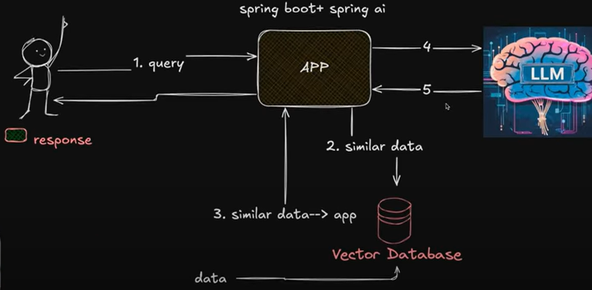

# Spring AI

## What is Spring AI?

Spring AI makes it easy to use **Artificial Intelligence (AI) models** inside **Spring Boot applications**.

- Helps developers (especially Spring developers) integrate AI models into their apps.
- Enables adding AI features without complex setup.
- Provides an **abstraction layer** between your app and AI models (so you don’t need to learn each provider’s API separately).
- Lets you call AI models just like calling a normal **REST API in Spring**.
- Works with multiple providers (OpenAI, Azure, Hugging Face, Ollama, Amazon Bedrock, etc.) with very little code change.
- Supports advanced AI concepts like **prompts**, **embeddings**, **RAG (Retrieval-Augmented Generation)**, and **chat history** in a simple, structured way.

---

## Key Features

- **Multi-Model & Provider Support**
    - Works with **OpenAI, Azure, Hugging Face, Ollama, Amazon Bedrock**, etc.
    - Switch providers easily by just changing configuration.

- **Spring-Friendly APIs**
    - Provides **Spring Beans** for AI clients.
    - You can inject and call AI like a normal Spring service.
    - Example: Injecting `ChatClient` interface
      ```java
      public class ChatController {
          private final ChatClient chatClient;
  
          public ChatController(ChatClient.Builder builder) {
              this.chatClient = builder.build();
          }
      }
      ```

- **Prompt Management**
    - Store prompts in external files (`.st`, `.mustache`, `.ftl`) instead of hardcoding.
    - Makes prompts **reusable and version-controlled**.
    - Example: prompt file (`greeting.st`):
      ```text
      Hello, my name is { name }. Can you greet me back nicely?
      ```

- **Embeddings Support (Vector DB + RAG)**
    - Generate embeddings from text using AI models.
    - Store in vector databases like **PostgreSQL, Redis, Milvus, Pinecone**.
    - Enable **RAG (Retrieval-Augmented Generation)** for smarter Q&A.

- **Chat History & Memory**
    - Supports **conversational memory** → remembers past interactions.
    - Useful for chatbots and customer support assistants.

- **Streaming Responses**
    - Stream tokens as they are generated (like ChatGPT live typing).

- **Integration with Spring Ecosystem**
    - Works seamlessly with **Spring Boot** (REST APIs, Security, Config).
    - Can be combined with **Spring Data** (for storing chat history & embeddings).
    - Supports **Spring Cloud Config** for centralized AI key management.

---


### Example Use Case: Customer Support Chatbot in Spring Boot

1. User asks: *“What is your refund policy?”*
2. Spring AI sends the question to **ChatGPT/OpenAI**.
3. If the answer is not in the prompt, Spring AI fetches relevant data from the **vector database** (where your FAQ documents are stored).  


---


## AI Concepts

### Models

- **AI models** are tools that learn from data to generate outputs such as **text, images, speech, or embeddings**.


```
Flow of an AI Model:

   Training Data
        |
        v
+----------------+
|   AI Model     |
+----------------+
        ^
        |
   +----------+
   |  Prompt  |  <---- User
   +----------+
        |
        v
     Answer

```


- **Spring AI** supports many types of models, including:
  - Text
  - Images
  - Audio
  - Embeddings (turning text into numbers for advanced tasks)

- Many supported models come **pre-trained** (like GPT), so you can start using them right away without training your own.

---

### Prompts

- A **Prompt** is what you tell the AI models — like a **question** or an **instruction**.
- In **Spring AI**, prompts can have **placeholders** (e.g., `{name}`) which get filled with real values at runtime — similar to using templates.

#### Underlying APIs & Abstractions

Spring AI provides a **unified and reusable API** to handle:

- Client Connection
- Vector Database
- Tool / Function Calling
- Observability
- Auto-Configuration and Spring Boot Starter
- RAG (Retrieval-Augmented Generation) Pattern

---

### Tokens

- **Tokens** are the smallest units of text that an AI model can understand.
- A token could be:
  - A whole word
  - Part of a word
  - Punctuation

### Example
- Word: **"Unbelievable"**
- Split into tokens: `["un", "believe", "able"]`


### Why Tokens Matter?

- **Cost** → AI services usually charge based on the number of tokens processed.
  - More text = More tokens = Higher cost 💰
- **Limits** → Models have a maximum token limit for input + output combined.

---

### Embeddings

- **Embeddings** turn **text, images, or videos** into **vectors** (arrays of numbers).
- These vectors capture **meaning/semantics** (not just the exact words).

#### Example
- **king** and **queen** → embeddings will be **close** to each other.
- **king** and **car** → embeddings will be **far apart**.


#### Why Use Embeddings?

- They allow you to **measure similarity** by comparing distances between vectors.
- Useful for:
  - **Semantic Search** → finding text/documents with similar meaning.
  - **RAG (Retrieval-Augmented Generation)** → fetching relevant information to improve AI responses.

---

## ChatClient API

- **ChatClient** is an interface that provides the higher level of abstraction between your app and AI model.
- **ChatClient** is a helper class that makes it super easy to interact with AI models (like **GPT-4, GPT-3.5, Azure OpenAI, Ollama**, etc.).
- It hides all the complex details (like making raw HTTP requests, handling tokens, parsing JSON).
- You just call its methods like a normal Spring service, and it returns AI responses.

```java
String resultResponse = chatClient
        .prompt(q)
        .call()
        .content();
```

### Key Points about ChatClient

- **Fluent API (Easy-to-use style)**
  - ChatClient uses a very simple chain-style way of writing code.
  - Example:
    ```
    chatClient.prompt("Hello").call().content();
    ```

- **Supports Different Modes**
  - **Normal Mode (Synchronous):** Works like a usual question-answer (you ask → it replies).
  - **Streaming Mode:** Works in real-time, where answers come word by word (like ChatGPT typing live).

- **Prompt Building (What you ask the AI)**
  - A **Prompt** = the instructions or question you give to the AI.
  - A Prompt is made up of **messages**.

- **Types of Messages**
  - **User Messages** → Your input (e.g., *“Write a poem about nature”*).
  - **System Messages** → Rules that guide the AI’s behavior (e.g., *“You are a polite assistant”*).

- **Dynamic Placeholders (Fill-in-the-blanks)**
  - Prompts can have placeholders like `{name}` which get filled with actual values when running.
  - Example: `"Hello, {name}"` → becomes `"Hello, Manish"`.

- **Prompt Options (Settings for AI)**
  - You can choose **which AI model** to use (e.g., GPT-4, GPT-3.5, Ollama Mistral).
  - You can set **temperature** (creativity level of answers):
    - **Low (0.1 - 0.3):** Predictable, accurate, factual.
    - **High (0.7 - 1.0):** Creative, fun, and varied responses.  


---


## ChatModel API

- **What is ChatModel?**
  - It represents a specific AI chat model provider (like **OpenAI, Azure OpenAI, Hugging Face, Ollama**, etc.).
  - Think of it as the direct connection to an AI model.

- **What it does**
  - You give it messages (your questions/instructions).
  - It returns responses generated by the model.

- **Examples of ChatModel implementations**
  - `OpenAiChatModel`
  - `AzureOpenAiChatModel`
  - `OllamaChatModel`

- **When to use it?**
  - Usually, in normal apps, we **don’t use ChatModel directly**.
  - Instead, we use `ChatClient` (because it’s simpler and user-friendly).
  - But if you need **fine-grained control** (advanced customization), then you can work with `ChatModel` directly.  


---

## 🔹 What is RAG?

**Retrieval-Augmented Generation (RAG)** is an AI technique that combines **retrieval of external knowledge** with **generative models**.

Instead of relying only on the model’s training data, RAG pulls **relevant documents/data from external sources** (DB, vector store, APIs) and uses that to **augment the prompt** before generating an answer.

---

## 🔹 Why RAG in Spring AI?

Spring AI provides ready-to-use **abstractions and integrations** for:

- **Vector Stores** → Postgres + pgvector, Pinecone, Redis, Elasticsearch, etc.
- **Embeddings** → OpenAI, Ollama, HuggingFace models
- **Retrieval APIs** → Fetch relevant chunks based on user query
- **ChatClient** → Stitches retrieval + generation seamlessly

---

## 🔹 RAG Workflow in Spring AI

### 1. Document Ingestion
- Split documents into chunks
- Generate embeddings
- Store embeddings in a vector database

### 2. Query Processing
- Convert query → embedding
- Search similar chunks in vector store

### 3. Augmented Prompt
- Combine query + retrieved context
- Send to LLM (via `ChatClient`)

### 4. Generate Answer
- LLM responds with **contextually grounded output**  





